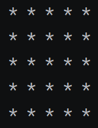
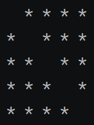

# Task 1:

## Draw custom shape:

At the first try to draw this shape on console. 

Next, try to remove the diagonal line from the shape.

- Use a nested for loop.
- Set the number of rows and columns to 5.
- Use the `end` parameter in the print statement.

---

# Task 2:

## Password handler:

Write a program that asks the user for a password and checks whether it is correct.

- If the password is incorrect, it must prompt the user for the password again.
- If the password is entered incorrectly three times, stop asking the user for the password.
- If the password is entered correctly within three attempts, an appropriate message should be displayed.
- Make the password your own name 😊.

---

# Task 3:

## paper, rock, scissors Game!

Create a Rock-Paper-Scissors game.

- The game is played between two players.
- Receive the moves of the first and second players from the input.
- Announce the result using conditional statements.
- (Optional) Modify the program so that the players play against each other multiple times, and keep track of each player's number of wins. The first player to reach 3 wins is the overall winner.

---

# Task 4:

## Identifying outstanding students

Write a program that accepts students' names and grades, then prints the top-performing students to the console.

- As a first step, you need to obtain the students' names and scores.
- To the extent that the user can enter the students' names and scores.
- Save the names of students who have a score above 17 in a list.
- Finally, print the list of all top students.

---

# Attention ❌

- You do not need to use dictionaries while doing the exercises above.
- Do not use ***artificial intelligence*** under any circumstances.
- Do not use material or topics that have not been addressed.
- If any questions come up, please ask in the group 😊.
